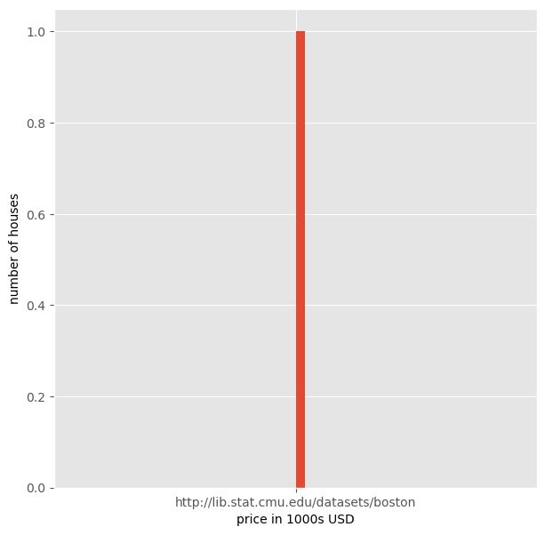
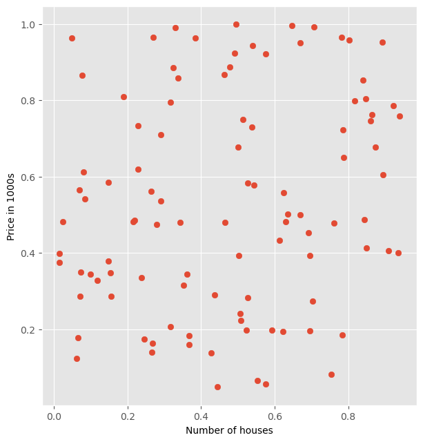
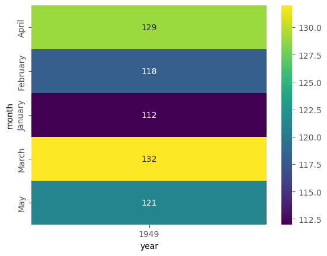

# Types of Plots

We can create different types of plots using matplotlib. Such as:

- Histogram
- Heat Map
- Error Bar
- Scatter Plot
- Pie Chart

## 1. Histogram

Histograms are graphical representations of a probibilitt distribution.
A histogram is a kind of a bar chart.

## 2. Scatter Plot

A scatter plot is used to graphically display the relationship between variables.

However,to control a plot, it is recommended to use scatter() method.

# Demo - Histogram and Scatterplot


```python
#import the bottom dataset from sklearn library

#from sklearn.datasets import load_boston

#import matplotlib

import matplotlib.pyplot as plt
from matplotlib import style 
%matplotlib inline


import pandas as pd
import numpy as np

data_url = "http://lib.stat.cmu.edu/datasets/boston"
raw_df = pd.read_csv(data_url, sep="\s+", skiprows=22, header=None)
data = np.hstack([raw_df.values[::2, :], raw_df.values[1::2, :2]])
target = raw_df.values[1::2, 2]
```


```python
#load boston dataset

boston_real_state_data= data_url
```


```python
print(boston_real_state_data)
```

    http://lib.stat.cmu.edu/datasets/boston


```python
# DEFİNE X AXİS FOR THE DATA

x_axis = boston_real_state_data
```


```python
# DEFİNE y AXİS FOR THE DATA
y_axis= boston_real_state_data
```


```python
style.use('ggplot')
plt.figure(figsize=(7,7))
plt.hist(y_axis,bins=50)
plt.xlabel('price in 1000s USD')
plt.ylabel('number of houses')
plt.show()

```


    

    


```python
#plot scatter plot
#style.use('ggplot')
#plt.figure(figsize=(7,7))
#plt.scatter(boston_real_state_data [ :,5], boston_real_state_data)
#plt.ylabel('price in 1000s')
#plt.xlabel('number of houses')
#plt.show()


import matplotlib.pyplot as plt
import numpy as np

# Örnek veri: Boston real estate data (örnek olarak rastgele oluşturuldu)
boston_real_state_data = np.random.rand(100, 6)  # 100 satır ve 6 sütunlu rastgele veri

plt.style.use('ggplot')
plt.figure(figsize=(7, 7.5))
plt.scatter(boston_real_state_data[:, 5], boston_real_state_data[:, 0])  # Sütun 5'e karşı sütun 0
plt.ylabel('Price in 1000s')
plt.xlabel('Number of houses')
plt.show()
```


    

    


## Types of Plots: Heat Map


```python
import matplotlib.pyplot as plt
import seaborn as sns
%matplotlib inline
```


```python
#load flights data from sns dataset (built in)
flight_data = sns.load_dataset('flights')
```


```python
#view top 5 records
flight_data.head()
```


<div>
<style scoped>
    .dataframe tbody tr th:only-of-type {
        vertical-align: middle;
    }

    .dataframe tbody tr th {
        vertical-align: top;
    }

    .dataframe thead th {
        text-align: right;
    }
</style>
<table border="1" class="dataframe">
  <thead>
    <tr style="text-align: right;">
      <th></th>
      <th>year</th>
      <th>month</th>
      <th>passengers</th>
    </tr>
  </thead>
  <tbody>
    <tr>
      <th>0</th>
      <td>1949</td>
      <td>Jan</td>
      <td>112</td>
    </tr>
    <tr>
      <th>1</th>
      <td>1949</td>
      <td>Feb</td>
      <td>118</td>
    </tr>
    <tr>
      <th>2</th>
      <td>1949</td>
      <td>Mar</td>
      <td>132</td>
    </tr>
    <tr>
      <th>3</th>
      <td>1949</td>
      <td>Apr</td>
      <td>129</td>
    </tr>
    <tr>
      <th>4</th>
      <td>1949</td>
      <td>May</td>
      <td>121</td>
    </tr>
  </tbody>
</table>
</div>


```python
#use pivot= method to re-arrange the dataset

import pandas as pd

# Örnek veri oluşturma
data = {
    'month': ['January', 'February', 'March', 'April', 'May'],
    'year': [1949, 1949, 1949, 1949,1949],
    'passengers': [112, 118, 132, 129,121]
}
flight_data 

#pd.DataFrame(data)
# Pivot işlemi
#flight_data_pivot = flight_data.pivot(index='month', columns='year', values='passengers')
#print(flight_data_pivot)
```


<div>
<style scoped>
    .dataframe tbody tr th:only-of-type {
        vertical-align: middle;
    }

    .dataframe tbody tr th {
        vertical-align: top;
    }

    .dataframe thead th {
        text-align: right;
    }
</style>
<table border="1" class="dataframe">
  <thead>
    <tr style="text-align: right;">
      <th></th>
      <th>year</th>
      <th>month</th>
      <th>passengers</th>
    </tr>
  </thead>
  <tbody>
    <tr>
      <th>0</th>
      <td>1949</td>
      <td>Jan</td>
      <td>112</td>
    </tr>
    <tr>
      <th>1</th>
      <td>1949</td>
      <td>Feb</td>
      <td>118</td>
    </tr>
    <tr>
      <th>2</th>
      <td>1949</td>
      <td>Mar</td>
      <td>132</td>
    </tr>
    <tr>
      <th>3</th>
      <td>1949</td>
      <td>Apr</td>
      <td>129</td>
    </tr>
    <tr>
      <th>4</th>
      <td>1949</td>
      <td>May</td>
      <td>121</td>
    </tr>
    <tr>
      <th>...</th>
      <td>...</td>
      <td>...</td>
      <td>...</td>
    </tr>
    <tr>
      <th>139</th>
      <td>1960</td>
      <td>Aug</td>
      <td>606</td>
    </tr>
    <tr>
      <th>140</th>
      <td>1960</td>
      <td>Sep</td>
      <td>508</td>
    </tr>
    <tr>
      <th>141</th>
      <td>1960</td>
      <td>Oct</td>
      <td>461</td>
    </tr>
    <tr>
      <th>142</th>
      <td>1960</td>
      <td>Nov</td>
      <td>390</td>
    </tr>
    <tr>
      <th>143</th>
      <td>1960</td>
      <td>Dec</td>
      <td>432</td>
    </tr>
  </tbody>
</table>
<p>144 rows × 3 columns</p>
</div>


```python
import seaborn as sns
import pandas as pd

# Örnek veri oluşturma
data = {
    'month': ['January', 'February', 'March', 'April', 'May'],
    'year': [1949, 1949, 1949, 1949,1949],
    'passengers': [112, 118, 132, 129,121]}
flight_data = pd.DataFrame(data)

# Pivot tablo oluşturma
flight_data_pivot = flight_data.pivot(index='month', columns='year', values='passengers')

# Isı haritası oluşturma
sns.heatmap(flight_data_pivot, annot=True, fmt="g", cmap="viridis")
plt.show()
```


    

    


## Tpes of Plots: Pie Chart


```python
import matplotlib.pyplot as plt
%matplotlib inline
```


```python
job_data = ['40','20','17','8','5','10']
labels = 'IT','Finance','Marketing','Admin','HR','Operations'
#explode the list slice which is IT

explode = (0.05,0,0,0,0,0)
#draw the pice chart and set the parameters
plt.pie(job_data,labels=labels,explode=explode)
#show the plot
plt.show()
```


    

    


```python

```
